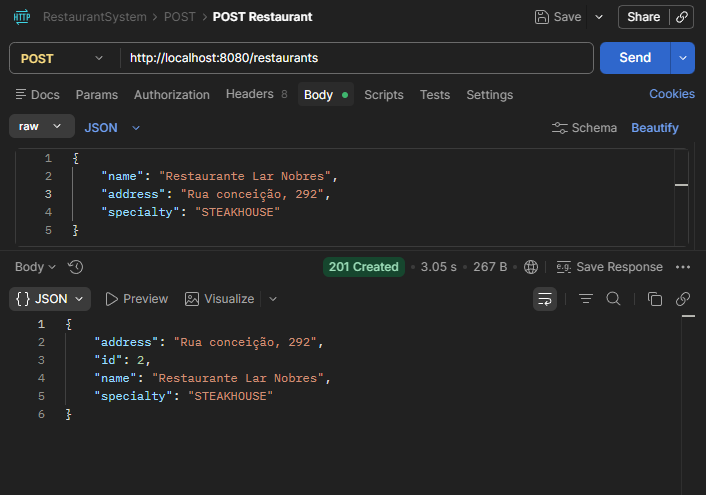
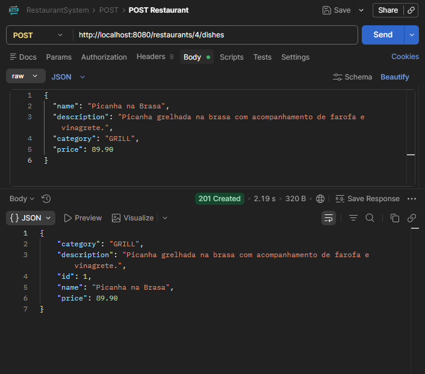
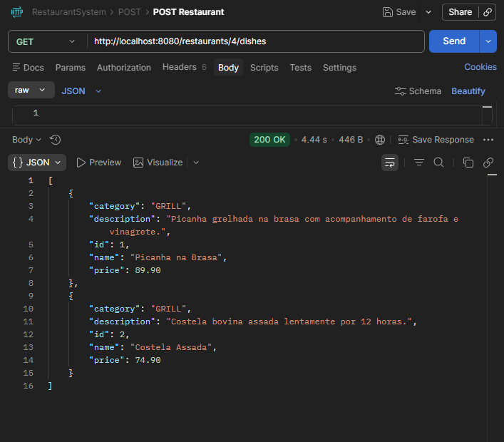
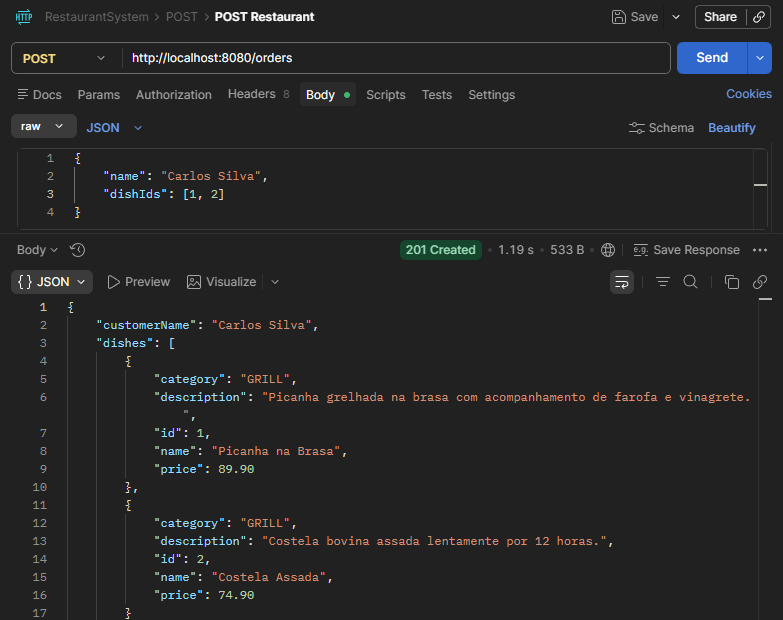
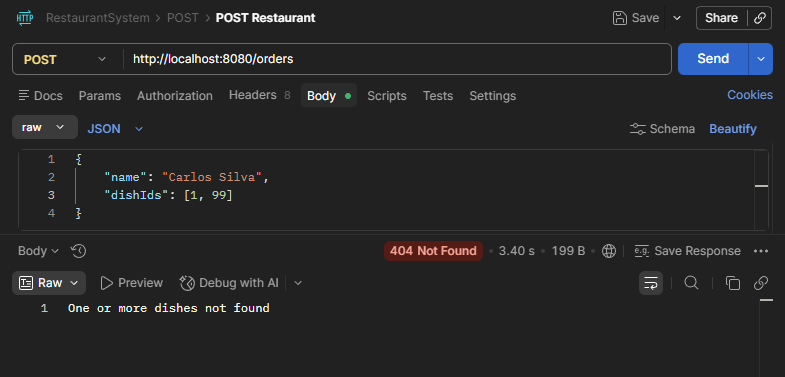

# RestaurantSystem

REST API for restaurant order management, built with Java and Spring Boot. The project simulates a real backend used in delivery or internal management systems, applying clean architecture, relational data modeling, and layered organization.

---

## Tech Stack

| Technology | Details |
|---|---|
| Language | Java 21 |
| Framework | Spring Boot 4.0.3 |
| Persistence | Spring Data JPA + Hibernate |
| Database | PostgreSQL 16 |
| Migrations | Flyway (planned — Level 3) |
| Validation | Jakarta Validation (Bean Validation) |
| Security | Spring Security + JWT |
| Boilerplate | Lombok |
| Build Tool | Maven 3.9.12 |
| Containerization | Docker + Docker Compose |

---

## Project Structure

```
src/main/java/br/com/flosi/restaurant/
├── controllers/        REST controllers (HTTP layer)
├── services/           Business logic layer
├── repositories/       Spring Data JPA interfaces
├── models/             JPA entities
│   └── enums/          Domain enums (DishCategory, OrderStatus, RestaurantSpecialty, UserRole)
├── dtos/               Data Transfer Objects (request/response)
├── exceptions/         Global exception handling
└── security/           Spring Security + JWT (JwtService, JwtAuthFilter, AuthService, SecurityConfig)
```

---

## Domain Model

### Entities

| Entity | Description |
|---|---|
| Restaurant | Represents a restaurant with name, address, and specialty |
| Dish | A dish offered by a restaurant with name, description, category, and price |
| Order | A customer order linked to dishes, with an auto-calculated total and lifecycle status |
| RestaurantTable | A physical table in a restaurant with a number and seating capacity |
| User | A system user with email, password, and role-based access |

### Relationships

| Relationship | Type |
|---|---|
| Restaurant → Dish | One-to-Many |
| Restaurant → RestaurantTable | One-to-Many |
| Order → Dish | Many-to-Many (via `order_items` table) |

### Enums

| Enum | Values |
|---|---|
| DishCategory | `APPETIZER`, `SOUP`, `SALAD`, `MAIN_COURSE`, `SIDE_DISH`, `FAST_FOOD`, `PASTA`, `PIZZA`, `SEAFOOD`, `GRILL`, `VEGETARIAN`, `VEGAN`, `DESSERT`, `BAKERY`, `BEVERAGE`, `HOT_BEVERAGE`, `COLD_BEVERAGE`, `ALCOHOLIC_BEVERAGE`, `COMBO`, `SPECIAL` |
| OrderStatus | `CREATED` → `CONFIRMED` → `PREPARING` → `READY` → `OUT_FOR_DELIVERY` → `DELIVERED` / `CANCELLED` / `PAID` |
| RestaurantSpecialty | `ITALIAN`, `JAPANESE`, `BRAZILIAN`, `MEXICAN`, `CHINESE`, `AMERICAN`, `FRENCH`, `MEDITERRANEAN`, `SEAFOOD`, `VEGETARIAN`, `VEGAN`, `FAST_FOOD`, `PIZZA`, `STEAKHOUSE`, `BAKERY`, `CAFE`, `BUFFET`, `FUSION` |
| UserRole | `WAITER`, `CASHIER`, `KITCHEN`, `BARTENDER`, `MANAGER` |

---

## API Endpoints

### Auth — `/auth`

| Method | Endpoint | Description |
|---|---|---|
| POST | `/auth/register` | Register a new user |
| POST | `/auth/login` | Authenticate and receive a JWT token |

### Restaurants — `/restaurants`

| Method | Endpoint | Description |
|---|---|---|
| GET | `/restaurants` | List all restaurants |
| GET | `/restaurants/{id}` | Get a restaurant by ID |
| POST | `/restaurants` | Create a new restaurant |
| PUT | `/restaurants/{id}` | Update a restaurant |
| DELETE | `/restaurants/{id}` | Delete a restaurant |
| GET | `/restaurants/{id}/dishes` | List all dishes of a restaurant |
| POST | `/restaurants/{id}/dishes` | Create a dish linked to a restaurant |
| GET | `/restaurants/{id}/tables` | List all tables of a restaurant |
| POST | `/restaurants/{id}/tables` | Create a table linked to a restaurant |

### Dishes — `/dishes`

| Method | Endpoint | Description |
|---|---|---|
| GET | `/dishes` | List all dishes |
| GET | `/dishes/{id}` | Get a dish by ID |
| POST | `/dishes` | Create a new dish |
| PUT | `/dishes/{id}` | Update a dish |
| DELETE | `/dishes/{id}` | Delete a dish |

### Orders — `/orders`

| Method | Endpoint | Description |
|---|---|---|
| GET | `/orders` | List all orders |
| GET | `/orders/{id}` | Get an order by ID |
| POST | `/orders` | Create a new order (total auto-calculated) |
| DELETE | `/orders/{id}` | Delete an order |

### Restaurant Tables — `/restaurant_tables`

| Method | Endpoint | Description |
|---|---|---|
| GET | `/restaurant_tables` | List all tables |
| GET | `/restaurant_tables/{id}` | Get a table by ID |
| POST | `/restaurant_tables` | Create a new table |
| PUT | `/restaurant_tables/{id}` | Update a table |
| DELETE | `/restaurant_tables/{id}` | Delete a table |

> All endpoints except `/auth/**` require a valid JWT token in the `Authorization: Bearer <token>` header.

---

## Getting Started

### Prerequisites

- Docker Desktop installed and running

### Run with Docker

```bash
git clone https://github.com/felipeflosii/RestaurantSystem.git
cd RestaurantSystem
docker compose up --build
```

The API starts on `http://localhost:8080`. The PostgreSQL database is automatically provisioned by Docker Compose — no external database setup required.

### Run Locally (without Docker)

```bash
# Requires Java 21 and a running PostgreSQL instance
git clone https://github.com/felipeflosii/RestaurantSystem.git
cd RestaurantSystem
./mvnw spring-boot:run
```

---

## Example Requests

**Register a user:**
```json
POST /auth/register

{
  "name": "Felipe",
  "email": "felipe@email.com",
  "password": "123456",
  "role": "MANAGER"
}
```

**Login:**
```json
POST /auth/login

{
  "email": "felipe@email.com",
  "password": "123456"
}
```

**Create a restaurant:**
```json
POST /restaurants

{
  "name": "Restaurante Lar Nobres",
  "address": "Rua Conceição, 292",
  "specialty": "STEAKHOUSE"
}
```

**Create a dish linked to a restaurant:**
```json
POST /restaurants/1/dishes

{
  "name": "Picanha na Brasa",
  "description": "Picanha grelhada na brasa com acompanhamento de farofa e vinagrete.",
  "category": "GRILL",
  "price": 89.90
}
```

**Create a table linked to a restaurant:**
```json
POST /restaurants/1/tables

{
  "tableNumber": 1,
  "tableCapacity": 4
}
```

**Create an order:**
```json
POST /orders

{
  "name": "Carlos Silva",
  "dishIds": [1, 2]
}
```

---

## API in Action

**POST /restaurants — Create a restaurant**


**POST /restaurants/{id}/dishes — Create a dish linked to a restaurant**


**GET /restaurants/{id}/dishes — List all dishes of a restaurant**


**POST /orders — Create an order with auto-calculated total**


**POST /orders — Error handling for non-existent dish**


---

## Development Roadmap

### Level 1 — Foundation (in progress)
- [x] Basic CRUD for Restaurant, Dish, and Order
- [x] Auto-calculated order total from dish prices
- [x] Status automatically set to `CREATED` on order creation
- [x] `createdAt` and `updatedAt` timestamps on Order
- [x] DTOs with validation via `@Valid`
- [x] Global exception handler
- [x] ResourceNotFoundException
- [x] Relationships: Restaurant → Dishes, Order → Dishes
- [x] PUT endpoints for Restaurant and Dish
- [x] Separate response DTOs from request DTOs
- [x] Negative price validation on Dish
- [x] Prevent ordering non-existent dishes
- [x] `POST /restaurants/{id}/dishes` and `GET /restaurants/{id}/dishes`
- [x] Docker + Docker Compose with PostgreSQL
- [x] Spring Security + JWT (login and registration)
- [x] User entity with role-based access (WAITER, KITCHEN, CASHIER, BARTENDER, MANAGER)
- [x] Protected routes — all endpoints except `/auth/**` require JWT
- [x] RestaurantTable entity with full CRUD
- [x] `POST /restaurants/{id}/tables` and `GET /restaurants/{id}/tables`
- [ ] Profiles dev/prod
- [ ] TableSession entity
- [ ] Refactor Order → TableSession
- [ ] OrderItem entity with destination enum (KITCHEN | BAR)

### Level 2 — Business Logic
- [ ] `PATCH /orders/{id}/status` with forward-only status transition validation
- [ ] Order queue with `queuePosition`
- [ ] Queue reordering by MANAGER role
- [ ] Queue visual status (next, position N, completed)
- [ ] Consolidated table bill via TableSession
- [ ] Independent status for food and drinks
- [ ] Cancel/edit order by role
- [ ] Prevent deletion of restaurants with active orders
- [ ] `GET /orders?status=` filter by status
- [ ] `GET /dishes?category=` filter by category

### Level 3 — Production Ready
- [ ] Database migrations with Flyway
- [ ] Environment variable configuration for Docker Compose
- [ ] Integration tests

### Future
- [ ] React frontend consuming the API
- [ ] WebSocket for real-time order queue updates
- [ ] Reports and metrics
- [ ] Push notifications
- [ ] Payment integration
- [ ] QR code menu per table
- [ ] Multi-tenant support
